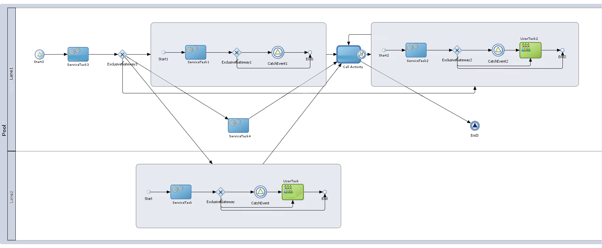
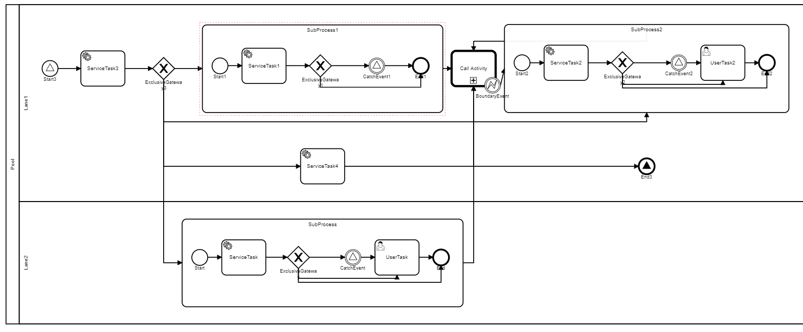

# Oracle Business Process Management BPMN Generator
The BPMN export from Oracle BPM does not provide the ```bpmndi``` BPMN standard diagram stanza and as a result it cannot be opened in Modeler. The Oracle BPMN export does include Oracle extensions which provides clues as to how to render the diagram. There are also other BPMN formatting issues with the Oracle export and this utility reads the Oracle export and creates a BPMN file that can be imported into other tools such as Modeler.

## How to use this utility
After cloning the repository and performing the necessary maven commands, either run the

```org.camunda.bpmn.generator.BPMNGenFromOracle```

main class in your IDE, passing in as arguments the input file and the output file or generate an executable jar file. The contents of the input file will be read and the output BPMN file will be generated. If you wish to generate an executable jar file issue the following maven command

```mvn clean compile assembly:single```

and execute the following command using the resulting jar file

```java -jar BPMNModelGenerator-1.0-SNAPSHOT-jar-with-dependencies input-file output-file```

A sample process in OracleBPM:


And the corresponding conversion:


## Notes and TODOs
You may need to move sequence flows for better process diagram clarity as there will be overlap but rest assured the file has been converted. The provided sample has had some of the xml removed for brevity. It has been tested with a limited number of Oracle examples and it may require tweaks depending on your process.
