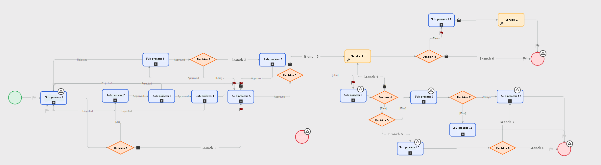
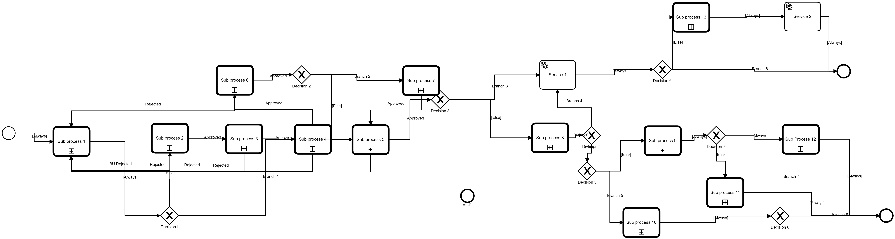

# Pega to Camunda 7 BPMN Converter
Processes developed in Pega are not compliant with the BPMN standard despite having process diagrams that are fairly BPMN-like. The xml generated for a process application is quite extensive but it can be read and translated into a BPMN equivalent. There are Pega constructs that don't quite have a BPMN analog such as tickets but this utility will provide the basic process flow saving you the effort of having to rebuild it manually. Even then you'll likely need to refactor the process to make it executable in BPMN.

## How to use this utility
After cloning the repository and performing the necessary maven commands, either run the

```org.camunda.bpmn.generator.BPMNGenFromPega```

main class in your IDE, passing in as arguments the input file and the output file or generate an executable jar file. The contents of the input file will be read and the output BPMN file will be generated. If you wish to generate an executable jar file issue the following maven command

```mvn clean compile assembly:single```

and execute the following command using the resulting jar file

```java -jar BPMNModelGenerator-1.0-SNAPSHOT-jar-with-dependencies input-file output-file```

A sample process in Pega:


And after conversion:


## Notes and TODOs
It has been tested with a limited number of Pega examples and it may require tweaks depending on your process.
