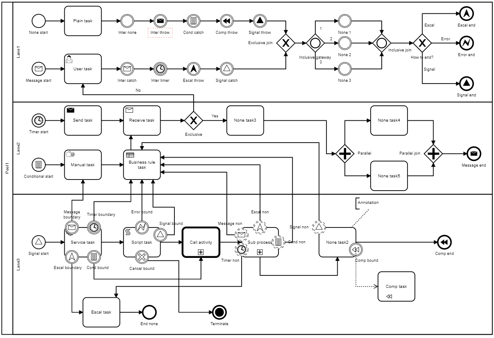
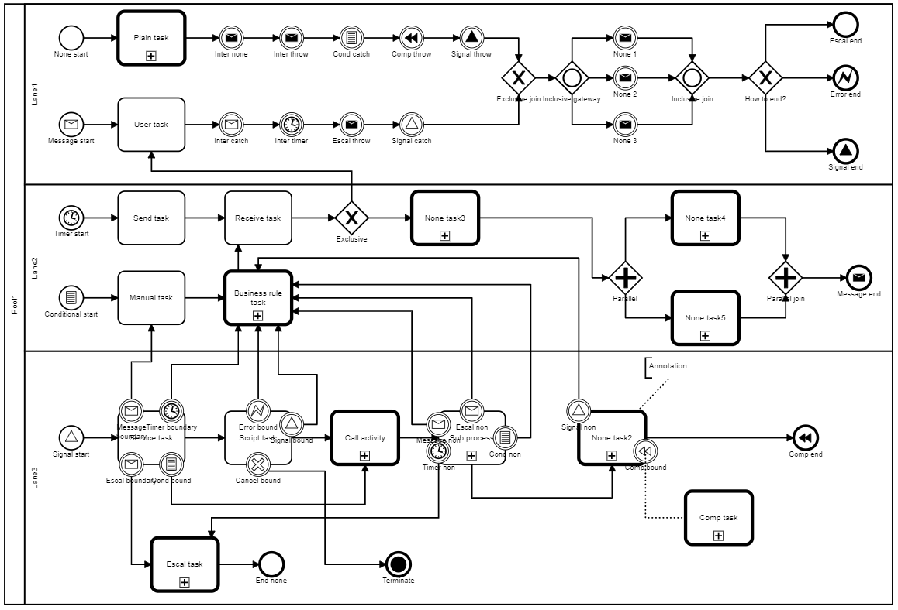

# TIBCO XPDL to BPMN Generator
The XPDL export format from TIBCO apparently follows the 2.1 version of the XPDL standard. This utility is based on that standard.

## How to use this utility
Export your candidate process from TIBCO (or any 2.1 XPDL vendor) and use it as your input parameter.

Now either run the ```org.camunda.bpmn.generator.BPMNGenFromXPDL```

main class in your IDE, passing in as arguments the input file and the output file or generate an executable jar file. The contents of the input file will be copied (and slightly updated) to the output file. If you wish to generate an executable jar file issue the following maven command 

```mvn clean compile assembly:single``` 

and execute the following command using the resulting jar file

```java -jar BPMNModelGenerator-1.0-SNAPSHOT-jar-with-dependencies input-file output-file```

BPMN file used to generate XPDL


After conversion from XPDL to BPMN:


## Notes and TODOs
Conversions still need some work to determine non-interrupting events, if possible. If vendors use the 2.2 or 3.0 XPDL standard there may need to be tweaks and/or additional utilities for those versions.
